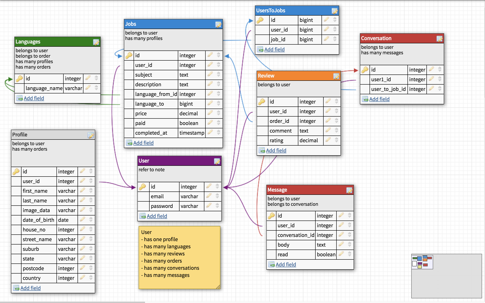

# **HOLA! ALOHA! - Marketplace Assignment**
*~ by Barbara Rodriguez ~*


Website:
[HolaAloha!](https://thawing-hamlet-85826.herokuapp.com/)

## **CONTENTS**
***

- **[The Design Process](#The_Design_Process)**
    -   [Mission](#Mission)
    -   [Idea](#Idea)
    -   [Research](#Research)
- **[Trello Board](#Trello_Board)**
    - [User Stories](#User_Stories)
        - [Customers](#Customers)
        - [Interpreters](#Interpreters)
- **[ERD](#ERD)**
- **[Workflow](#Workflow)**
- **[Models](#Models)**
- **[Mood Board](#Mood_board)**
- **[Colour Schemes](#Colour_schemes)**
- **[Fonts](#Fonts)**
- **[Wireframes](#Wireframes)**
    - [Mobile](#Mobile)
    - [Desktop](#Desktop)
- **[Ruby Gems and Api's Used](#Ruby_Gems_and_Api's_Used)**
    - [Gems](#Gems)
    - [Api's](#Api's)
- **[Problems & Solutions](#Problems_and_Solutions)**
- **[Improvements](#Improvements)**
- **[Final Review](#Final_review)**

## **The Design Process**
***

>### **Mission**

- To design, build, deploy and present a Ruby on Rails Application.
- Application must be a two-sided marketplace
- Deliver a 7-minute presentation - PITCH IT!

> ### **Idea** 

Create an app that provides a two-sided marketplace for Language Exchange services. 

The name of the application/website will be "Hola! Aloha!".

 ### *So..what is it?*

It's an application for individuals/businesses who require documents/files translated in an efficient and timely manner whilst, being assured - it's provided by certified professionals.

### *What does the application offer?*

- Services provided by Interpreters and Translators will by certified by [NAATI](https://www.naati.com.au/) (National Accreditation Authority for Translators and Interpreters)
- Easy to use registration/log-in services
- Ratings based profiles 
- Live notification and messages system to ensure efficient communication between users
- FAQ page to assist users

>### **Research**

Current language exchange services:

-   [Gengo](https://gengo.com)
-   [NATTI](https://www.naati.com.au/)
-   [Melbourne Translation](https://www.melbournetranslation.com.au/)
-   [Melbourne Certified Translator](http://www.melbourne-certified-translator.com.au/)
- [Migration Translators](https://www.migrationtranslators.com.au/)
- [Beyond Translations](https://www.beyondtranslation.com.au/)

 **Results based on top 5 sites on Google search - "certified translators melbourne".*


## **Trello Board**
***
**[Trello Board - Hola! Aloha! Marketplace](https://trello.com/b/zh6GFXyq/hola-aloha-marketplace#)**

>

>### **USER STORIES**

My Users consist of two profiles - Customers and Interpreters. Users can sign-up, but will need to create a profile before initializing an order through the application. Customers and Interpreters will be able to communicate via an instant message notification system to ensure speedy response times by both users. Both Customers and Interpreters can send a request for an order; thus eliminating the need to create multiple profiles.

### **Customers**
- As a customer, I want to get my birth certificate translated so that I can apply for my Australian passport.
- As a customer, I want to get my name-change document translated, so that I can apply for my student visa.
- As a customer, I want to get my client's Will document translated, so that I can proceed with insurance claims.
- As a customer, I want to get my client's bank statement translated, so that I can plan my client's retirement.
- As an individual, I want to get my name-change document translated, so that I can apply for my student visa.


### **Interpreters**
- As an Interpreter, I want to choose my own hourly rate, so that I know what my time is worth.
- As an Interpreter, I want to be able to search clients quickly, so that I can work more efficiently.
- As an Interpreter, I want to be able to  choose my client, so I know where my skills are put at to best.
- As an Interpreter, I want to be able to  expand my services to businesses, so that I can grow my own clientele.

## **ERD**
***
My ERD consists of using simple and effective models to interact with controllers; this is to avoid clutter within the rails application.

*Link to my **[DB Designer ERD](https://www.dbdesigner.net/designer/schema/167759)**.*
>


## **Workflow**
***
I developed a workflow document to provide a visual representation of how my website application will flow through as a new user. 

*Link to my **[Flowchart](https://www.draw.io/?lightbox=1&highlight=0000ff&edit=_blank&layers=1&nav=1&title=HolaAloha_app#R7Vxfc5s4EP80fmwGIf75sXHba2fu5jrNTO%2F6KINic8WIYhwn9%2BlPGAmQFlxMZOpL7DwEFmkltL9d7a7WnuHF5vG3nGTrP1hEk5ltRY8z%2FG5m2wgji%2F8rKU8VxXYcp6Ks8jgSrRrCXfwvFUTRcbWLI7pVGhaMJUWcqcSQpSkNC4VG8pzt1Wb3LFFHzciKAsJdSBJI%2FSuOirWgIstqHnyk8Wothg5c8WBJwu%2BrnO1SMd7MxveHT%2FV4QyQv0X67JhHbt0j4%2FQwvcsaK6mrzuKBJubhy2ap%2BH3qe1vPOaVoM6YCrDg8k2VE548O8iie5FjTiSyNuWV6s2YqlJHnfUG8P70tLjojfrYtNIi4TsqTJbb0kC5awnD9KWVp2o2n0tpQVpywTFn6vSB%2FiRHbfFjn7TmUvvpTOu%2FKvfiJFw1ft9p6lxQeyiZMScl9pHpGUCLKAF5LN5Mugw4BF%2FvQ3v7Hkzbfy5sblt9VKlK%2BvLO6W7fJQkFyBTZKvqIQCFAGqBcs1hrIN5cPwJjlNSBE%2FqNyJQO6qbld3%2FcxiztG2hJp5vsCQULI3yHUslUk1L9GvQQFfdfLUapaVDbb9IzlwJE%2BBFb%2BoeMq71ns2pAP0umHovHYYPsZFjUJ%2BfRII5eqdH3Io8FQgzD1X5VHNCyAOcKoNYA0p%2B0zgtb1AG8nSbaL%2Blp4%2Bt9N7yLcxpSBuh4J4SSGgpGiK92PH5IM32wPo3vIGaJ49Ng%2F51ar8%2F5FPgj%2F8XO6HgiGfSsWzaiHJy7yhaKq5X8cFvcvIAZB77hKo6qfqZb3jlVgP2SYOxXWHMnEdbKld5NIgcvqVjCTxKuWUkGsBzQdoHVDswF5iz6tf8YHmBX1UdGWAjokO2LM1TDhzgZJ941LY0qNYt70JTRPaitlC1FHAeAAwb8OQZiVUvtAfO7otLkewwkMyJdjny85zfE12yBkoO9eA7Hwguzu%2BAG%2Fi9KJEZofhOXUx8paea0wXkSZP7LjD5OkZkGcA5PmFruJtuTBXgY5T0AB4pEONqwmBzoFAFzklxWEnzRlfWXo1pbWkXKB6E5pSmVC4RhY37rwVXKAbyxO3n2ke83Ut0dBEwVUXHKhRcdWnvNc7zX4epohdrR0ryyDg%2FJGLA%2BMNX4PX0NDFBbbnXKGL4897Jt03N1%2FGgn09nh2IIGkUBioUTZZs%2F9J0aUyU7k8GdaQ7O6OhjiGc9O3TENThSBgfhzru1ejeHlBxveM9HHTyGLZ34hgYJNfs%2BcljBIaV3L7umnLXbG%2BawzQd4alU3YfOlT8yIdfBauCuNgZf8NjhK%2FdMo8qFphsSJxcVGZl0qTvwax0%2BpiIjXY61EZvE3371mfzGe3YV5%2Fm5VkUkEdruM3KnMzT69uyikT4FZOUM9CnGGBqYNz%2Bk0nbZrDwVzjdXM2MqATM4u23EzMD09iszM72m5JgB6jEzik2Z0HnR4xQHe2NtCmCFNFYGbQpMzx%2FF3suJgLvRM0FE66ObXq%2FmVKw4vq07urpFMogVmPp%2FJVhpGSKkmKHaYFU2yh7oCrVt1GSplI7ktT0Sdp4Fkw%2F%2BINidmkrpGGnuHp%2BbA5Iv9k96gDEwUno8PwUBz1iA5pTQz3qdGVEbSJay%2BfBkc70ueumIjQceG5pwcuSEW0vwqfT9spxe1NFhRGhwf9ajQy8M6PJ%2BsOc675bqJDIbkB7nK52VlyQsyhe8HSwma7iYkIEAoz%2BAMHBo2CMjWbSlHnwEUOkcKD9sQn7XzOeJOYoJAgWsb08oGJvlhKwcjZU556%2BjuPrPPCott7VgmyzhVjz6VTb78uoEQMmV5U6YUOioQP6UPrA4pAf8hpTDN7qcLffixNdRZdtRYYUCu0N8rgHxwTzfF%2FoQ0%2F1VaEeE5rggUujwb5Hbsdca0TnDSTxLFds%2FtCiexPKRXcE4qeHwO2PZ8X1NqbCfLOLEcg2aDep82fGOQtPFbltwFvmv0pGLiyWOWz0grbo%2Boq1AfnAmBeoqLBW13dZ2t9zExctxMc58oGG7elEFcqeM9QekO65x40%2BF6IANrcuJPFPsiGG%2B5uh%2B9n9N9qpFompy1z9SDddO4XpTbagO%2BGoW0mU9%2BOQAuEuW7ruaKvwEp6sIma3wwq%2B2jPPXZTH0swRrPhKIHazOd4SFT8yIvRyk9B9h%2BcoZVitPNvw7uxjaxOm%2Bx1vXajQAQiMzaoDV%2FHwJNTzk1wogbCKyXXfhT4XTeMPQci3cI%2B7hc2UGj%2FWwczNWajDyR3OdmUHBDakKHCu4ET%2FhMPI7KNMI2rNA0f1Y5fRcwMoytVHw2%2BZnSqrmzY%2FB4Pf%2FAQ%3D%3D)**.*
>

## **Models**
***

```
User
- email :string
- password :string

Profile 
- first_name :string
- last_name :string
- image_data :text
- date_of_birth :date
- house_no :string
- street_name :string
- suburb :string
- state :string
- postcode :string
- country :string

Languages
- en :string

Jobs
- subject: text
- description :text
- file_data :text
- price :integer
- paid_at :datetime
- stripe_charge_id :string
- completed_at :string

Conversations
- sender_id :integer

Messages
- from_id :integer
- body :text
- read :boolean

Review
- comment :varchar
- rating :decimal

```

## **Mood Board**
***


## **Colour Schemes**
***


## **Fonts**
***


## **Wireframes**
***

*Link to my **[Figma Page](https://www.figma.com/file/aBwKv8BxjMeN3Da8AZoft00w/HolaAloha_app)**.*

>### **Mobile**


>### **Desktop**


## **Ruby Gems and Api's Used**
***

>### **Gems**

- **Rspec** (Testing Framework)
- **Dotenv-Rails** (Environment Variables)
- **Devise** (Authentication)
- **Pundit** (Authorization)
- **Stripe** (Payments)
- **Shrine** (File Attachment)
- **Mailgun** (Transactional Emails
- **Faker** (Generates fake data)
- **Language Lists** (Generates Languages)
- **PG** (Postgres)

>### **API's**

- **Stripe** (Payments)
- **Mailgun** (Transactional Emails)

## **Problems and Solutions**
***

> ## _"Where do I start???!!!"_


>### **Encounters**

During my development process, I encountered numerous problems - anywhere from the design stage to deploying my website Heroku.

In summary, below is a display of problems/errors encountered along the way.

This includes any students/teachers that may have contributed with solving the issue/s at the time.
___

| Type  | Problem | Solved?  |  Contributers? |
------------- | ------------- | ------------- | -------------
| _**Models ERD**_  | Incorrect relationships & references | `Yes` | Ruegen 
| _**Faker GEM**_  | Unable to create 'fake' users | `Yes` | Pete
| _**Pundit GEM**_  | Unable to get Pundit to work | `No` |  
| _**Stripe GEM**_  | Issues with 'price' and params | `Yes` | Richard & Meng
| _**Shrine GEM**_  | Unable to display images | `Yes` | Mill
| _**Mailgun GEM**_  | Unable to make gem work | `Yes` | Meng
| _**Search Bar**_  | Unable to search 'jobs' in search field | `No` | 
| _**Stylesheets**_  | Stylesheets not loading properly | `Yes` | 
| _**Heroku**_  | Issues deploying | `Yes` | Pete & Meng
| _**MVC**_  | Methods and params | `~` | Meng/Pete/Cameo/Matt
| _**Routing**_  | Countless routing issues | `Yes` | 
| _**Tables**_  | _N/A_ | `N/A` | Maxi

## **Improvements**
***

- Ensure ERD is correct - triple check if _**Necessary!!**_
- Git branch! Git commit! I didn't use it at the start as much as I needed to
- Collaborate with other students and teachers more to bounce ideas/solve problems
- Careful with scaffold (could get messy at times)
- Leave styling to the end

>..There's __"Always"__ room for improvement

## **Final Review**
***

Although difficult and  _**"EXTREMELY"**_ tiresome, this assignment has pushed the boundaries - and in doing so - has given me a great learning experience and beyond what I thought I could achieve in a short amount of time.

ROR has a lot to offer - and I see how it has been used by so many developers.


